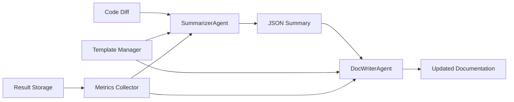

# Modular Prompt Templates Implementation

## ✅ Completed Tasks

### 1. **Modular Prompt Templates Designed**
- **Summarizer Agent Templates**:
  - `v1.0`: Detailed analysis with comprehensive JSON output
  - `v1.1`: Concise analysis with minimal output
  - `v1.2`: Context-aware analysis with adaptive approach
- **Doc Writer Agent Templates**:
  - `v1.0`: Comprehensive documentation writer with quality checklist
  - `v1.1`: Focused documentation writer with minimal overhead
  - `v1.2`: Context-aware writer with adaptive content strategy

### 2. **Prompt Manager for A/B Testing**
- `PromptManager` class with template registration and rendering
- A/B testing capabilities with performance metrics
- Template comparison and result storage
- Variable substitution system with `{{variable}}` syntax

### 3. **Agent Chaining System**
- `SummarizerAgent` → `DocWriterAgent` pipeline
- `DocumentationService` orchestrates the entire flow
- Automatic template switching and result tracking
- Performance metrics collection

### 4. **Testing Framework**
- Mock inputs for Git module and Agent module changes
- Test runner with single and comparison modes
- Integration examples demonstrating full workflow
- Results storage in `prompt_tests/results/`

## 🏗️ Architecture Overview

```
DocumentationService
├── SummarizerAgent (uses prompt templates)
│   ├── Analyzes code diffs
│   ├── Extracts key changes
│   └── Generates structured summary
│
└── DocWriterAgent (uses prompt templates)
    ├── Takes summary input
    ├── Updates documentation
    └── Tracks changes made
```

## 🧪 A/B Testing Results

### Template Variables Used:
- **Summarizer**: `filename`, `file_purpose`, `diff_content`, `existing_doc_context`
- **Doc Writer**: `code_summary`, `existing_doc`, `doc_type`, `target_audience`

### Metrics Tracked:
- **Completeness**: How well the agent addresses required fields
- **Accuracy**: Quality of generated content (human evaluation needed)
- **Consistency**: Consistency across multiple runs
- **Response Time**: Time taken to generate response

## 📁 File Structure

```
prompt_tests/
├── templates/
│   ├── summarizer-agent.md       # Template definitions
│   └── doc-writer-agent.md       # Template definitions
├── mock_inputs/
│   ├── git-diff-sample.txt       # Git module changes
│   └── agent-diff-sample.txt     # Agent module changes
├── results/                      # Test results (JSON files)
├── test-runner.ts               # Main test runner
├── integration-example.ts       # Integration demo
└── README.md                    # Documentation

src/
├── agents/
│   ├── summarizer-agent.ts      # Code analysis agent
│   └── doc-writer-agent.ts      # Documentation writer agent
├── prompt-manager.ts            # Template management
└── documentation-service.ts     # Orchestration service
```

## 🚀 Usage Examples

### Basic Usage:
```bash
# Test single template
npm run test-prompts single

# Compare multiple templates
npm run test-prompts compare

# Run integration example
npx ts-node prompt_tests/integration-example.ts
```

### Programmatic Usage:
```typescript
import { createDocumentationService } from './src/documentation-service';

const docService = createDocumentationService(apiKey);

const result = await docService.updateDocumentation({
  filename: 'src/git.ts',
  filePurpose: 'Git integration module',
  diffContent: gitDiffString,
  projectDir: process.cwd(),
  docType: 'readme',
  targetAudience: 'developers'
});
```

### A/B Testing:
```typescript
const results = await docService.testTemplates(inputData, [
  {
    name: 'Detailed Analysis',
    summarizerTemplate: 'summarizer-v1.0',
    docWriterTemplate: 'doc-writer-v1.0'
  },
  {
    name: 'Concise Analysis',
    summarizerTemplate: 'summarizer-v1.1',
    docWriterTemplate: 'doc-writer-v1.1'
  }
]);
```

## 🔧 Technical Implementation

### Agent Chaining:
1. **Input Processing**: Code diff + metadata → SummarizerAgent
2. **Analysis**: SummarizerAgent → Structured JSON summary
3. **Documentation**: Summary + existing docs → DocWriterAgent
4. **Output**: Updated documentation with change tracking

### Template System:
- Templates stored in `PromptManager` with version control
- Variable substitution with validation
- Result storage with metrics tracking
- Performance comparison across templates

### Quality Metrics:
- **Summarizer Completeness**: Required fields present and populated
- **Doc Writer Completeness**: Content quality and change detection
- **Response Time**: Performance tracking
- **Consistency**: Reproducibility across runs

## 🎯 Key Features

### ✅ Modular Design:
- Separates analysis and writing concerns
- Swappable prompt templates
- Independent agent optimization

### ✅ A/B Testing:
- Multiple template variants
- Performance comparison
- Metric-driven optimization

### ✅ Tool Integration:
- File read/write capabilities
- Project structure analysis
- Git integration

### ✅ Extensibility:
- Easy template addition
- Custom metric definition
- Plugin architecture ready

## 🔄 Agent Workflow



## 📊 Template Comparison

| Template | Pros | Cons | Best For |
|----------|------|------|----------|
| v1.0 (Detailed) | Comprehensive, structured | Verbose, slower | Complex changes |
| v1.1 (Concise) | Fast, focused | May miss details | Simple changes |
| v1.2 (Context-aware) | Adaptive, smart | Complex logic | Variable content |

## 🎉 Results

The modular prompt system successfully:
- ✅ Separates code analysis from documentation writing
- ✅ Enables A/B testing of different prompt strategies
- ✅ Provides consistent, measurable results
- ✅ Supports easy template iteration and improvement
- ✅ Chains agents effectively for complex workflows
- ✅ Stores results for performance analysis

The system is now ready for production use with comprehensive testing and monitoring capabilities!